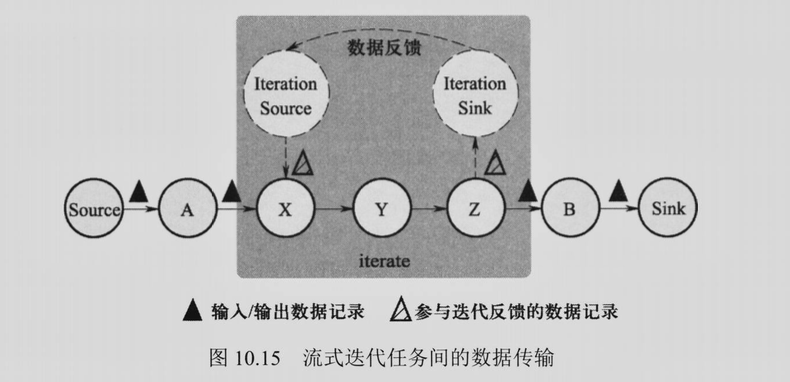

# 习题 10

#### 1. Flink 采用何种方式表示数据？它与 MapReduce、Spark 有何区别？

由于 Flink 需要处理的数据是同时具有有界和无界状态的，它将需要处理的数据抽象为 DataStream 形式。与 MapReduce 与 Spark 的区别是 DataStream 形式的数据是无界数据。

#### 2. 在 Standalone 模式下，Flink 的架构中都有哪些部件？每个部件的作用是什么？

- 客户端 Client：把用户编写的 DataStream 程序翻译并且进行优化，把优化后的逻辑执行图提交到 JobManager，系统运行时 Client 的进程名叫 CliFrontend。
- 作业管理器 JobManager：根据逻辑执行图生成物理执行图，负责协调作业的物理执行，包括任务调度、协调检查点与故障恢复等。也负责资源管理，系统运行时的进程名为 StandaloneSessionClusterEntrypoint
- 任务管理器 TaskManager：用于执行 JobManager 分配的任务，并且负责读取数据、缓存数据、和其他节点的数据传输。也负责节点的资源管理，运行时启动的进程叫做 TaskManagerRunner

#### 3. Standalone 模式下，Flink 的 JobManager 与 TaskManager 与 Spark 的 Master 与 Worker 在功能上是否一致？

不一致，Spark 的 Master 和 Worker 两个部件负责的是资源管理，在资源管理部分与 Flink 的部件是一致的。但 Flink 的部件在 Standalone 模式下还负责作业管理，在作业管理的范畴内，JobManager 负责功能与 Driver 类似，TaskManager 负责的功能与 Spark 中的 Executor 类似。

#### 4. Standalone 模式下，同一个 TaskManager 可能会同时执行不同应用程序的任务，某种程度上会存在应用程序间的相互干扰，引入 Yarn 以后是如何解决这个问题的？

Standalone 模式下出现应用程序间的相互干扰本质上是因为作业管理与资源管理没有相互分离。引入 Yarn 以后分离了作业管理与资源管理，无论是应用运行模式还是作业运行模式，不同 Flink 应用 / 作业的运行互不干扰。

#### 5. Flink 中的逻辑执行图和物理执行图是如何产生的？与 Spark有何区别？

给定编写的 DataStream 程序，Client 将其解析为逻辑执行图。根据类似于Spark 中窄依赖与宽依赖的理念，使用 Chaining 机制进行优化，合并算子节约执行这些算子的任务。

JobManager 收到 Client 生成的逻辑执行图后，根据算子的并行度，把逻辑执行图转换为物理执行图。

Spark 不会在逻辑层面对算子进行合并，而是由 Driver 进行划分，将同个 stage 的算子放在同个物理节点，事实上实现了 Flink 中对逻辑执行图的优化。

#### 6. Flink 非迭代任务之间如何进行数据传输？与 Spark 和 Storm 有何区别？

采用 pipeline 进行传输，一次传输一个缓冲区；Spark 的数据传输是阻塞式的，而 Flink 和 Storm 的是非阻塞的。Flink 的粒度是缓冲区，Storm 的粒度是行。

#### 7. 简述异步屏障快照的功能。

异步屏障快照算法通过在输入数据中注入屏障并异步地保存快照，达到和在同一时刻保存所有算子状态到检查点相同的目的。

在异步屏障快照中，数据不断流入系统，当一个任务收到所有来自标识为 n 的屏障后将其状态保存。所有算子保存的状态形成检查点 n。如果此时发生故障，则将所有算子对应的任务还原为检查点对应的状态。（那么这个时候的状态相当于这个屏障前的所有数据都已经完成了）

#### 8. Flink 中迭代算子如何实现数据反馈？

Flink利用迭代前端(Iteration Source)和迭代末端(Iteration Sink)两类特殊的任务实现数据反馈，两类任务成对处于同一个TaskManager,迭代末端任务的输出可以 再次作为迭代前端任务的输入。在流式迭代计算中，通常每轮迭代计算的部分结果作为输出向后传递，而另一部分结果作为下一轮迭代计算的输入。

#### 9. 如果 Flink 系统不进行状态处理，会带来哪些缺陷？

Flink 提供的特殊的数据结构状态（State）用于保存操作算子的计算结果。状态可以看作算子的记忆能力，可以对已经处理的结果进行保留，并且对于后续的处理造成影响。算子的状态就相当于其检查点，系统可以根据前一时刻保存的算子的状态对于出现故障的系统进行恢复。如果不进行状态管理，一旦出现故障系统需要从头开始计算，对于用户来说是无法实现的，因为Flink到来的数据是数据流。

#### 10. MemoryStateBackend 与 FsStateBackend 两种状态存储方式哪一种更加适合实际生产环境？

两者都是把状态存储在系统内存中。写检查点时，MemoryStateBackend 在保存检查点时把状态发送给 JobManager 并且存储至其内存，而 FsStateBackend 在保存检查点时将状态存储于 HDFS 等文件系统。后者更适合实际生产环境，因为 JobManager 的内存毕竟是有限的，可能无法保存全部的信息。此外，JobManager 故障也可能导致信息丢失。HDFS 是可靠的，不会导致信息丢失。

#### 11. Flink 为何无法像 Spark 那样利用 Lineage 进行故障恢复？

利用 Lineage 可以进行的是基于静态数据的故障恢复，就是说当出现故障的时候 Spark 系统会根据运行到的 stage、磁盘中的数据信息、DAG 图来进行恢复数据。但是 Flink 的数据是动态的，在发生故障的时候每个节点上都可能有数据进行计算，因此无法知道发生故障时每个节点的准确状态，因而无法进行故障恢复。