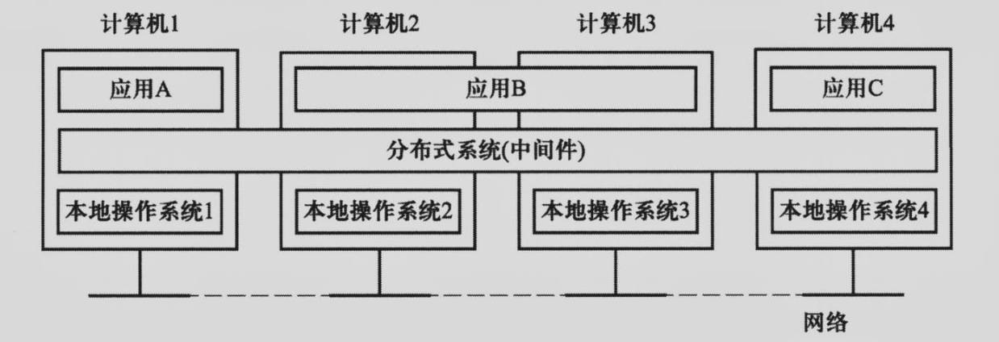
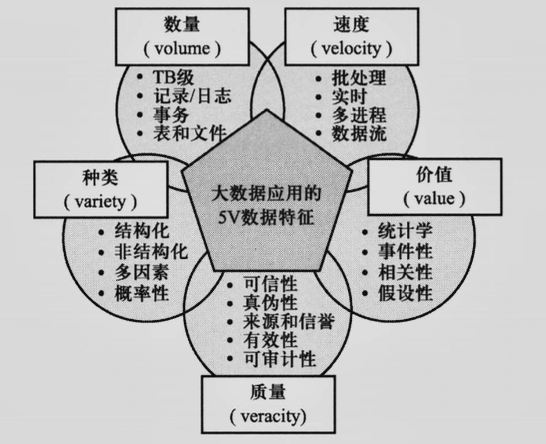
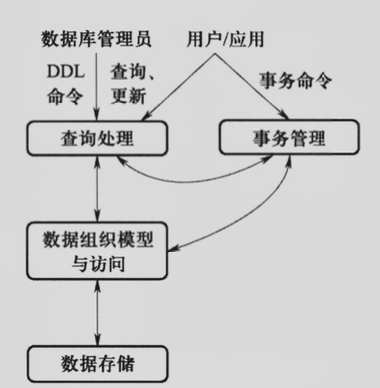

# 习题1

#### 1. 简述分布式系统的概念

分布式系统是若干个独立计算机的集合，这些计算机对于用户来说就像是一个单机的系统。为了使用户体验上觉得这是一个单机的系统，分布式系统常通过一个“软件层”组织而成。该软件层在逻辑上位于由应用组成的高层和于本地系统组成的低层之间，有时被称为“中间件”。

#### 2. 分布式系统可以分为哪些类型

根据依赖硬件的不同，分为基于计算机构建的分布式系统和基于微型设备构建的分布式系统。

根据用途的不同，基于计算机构建的分布式系统又可进一步分为分布式计算系统和分布式信息系统。

分布式计算系统支持高性能计算与大规模信息处理，一组计算机通过局域网构建的集群可以提供强大的计算能力。云计算的日益成熟让传统的网格计算退出了历史舞台。

分布式信息系统主要利用分布式系统技术构建信息管理系统，包括用于实现事务处理、企业应用的集成等。

基于微型设备构建的分布式系统又可称为分布式普适系统，包括智慧家庭系统、 电子健康系统、传感网络系统等。

#### 3. 简述数据管理系统的发展历程

第一代数据管理系统，以层网模型为主，功能偏重于数据的组织与存取。

第二代数据管理系统，以关系数据库为主，功能主要围绕于 OLTP 联机事务处理展开，重点发展事务处理子系统、查询优化子系统等等。

第三代数据管理系统，指的是数据仓库系统，主要功能是 OLAP 联机分析处理。

第四代数据管理系统，主要围绕大数据应用展开，即大数据管理系统，重点发展分布式可扩展、异地多备份高可用性架构、多数据模型支持以及多应用负载类型支持等特性。

#### 4. 简述大数据的特征

5V：Volume 数量、Variety 种类、Velocity 速度、Value 价值、Veracity 质量。

#### 5. 数据库系统包含哪些主要的功能模块？

数据存储、数据组织模型与访问、查询处理、事务管理

#### 6. 数据密集型应用和计算密集型应用有何区别？

计算密集型应用处理时CPU能力成为瓶颈，数据密集型应用处理时I/O带宽成为瓶颈

#### 7. 通用数据处理系统可以分为哪些类别？其分别适用于何种场景？

① 批处理系统：适用于静态数据，其数据吞吐量高，对于实时性要求低

② 流计算系统：适用于动态数据，其数据吞吐量低，对于实时性要求高

③ 批流融合系统：可用于上述两类场景，也可用于同一场景不同模块的数据特征和计算需求不同的场景。

#### 8. 分布式计算系统本身并无数据存储功能，则其数据从何而来，输出结果又走向何方？

数据来自于分布式存储系统，资源管理交给分布式资源管理系统，高可用性保证交给分布式协调服务系统。输出结果给程序员复用或者直接交给用户。