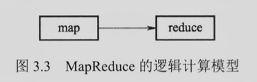
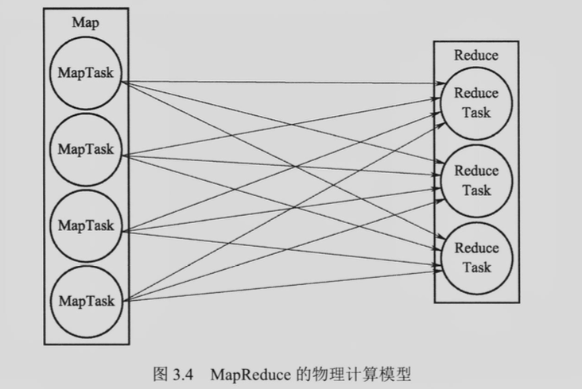
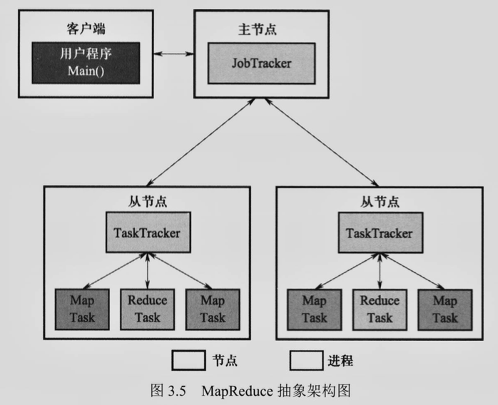
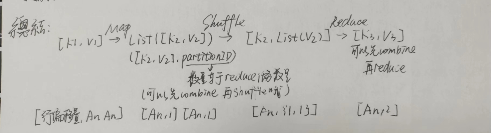

# 习题 3

#### 1. MapReduce 与 MPI 相比所具有的优势是什么？

- MapReduce 将分布式程序的通讯接口进行了封装，因此减轻了程序员的工作量，降低了编程难度；
- MapReduce 提供容错机制，而 MPI 本身不提供，因此程序员不需要自己实现容错，提高了可靠性。

#### 2. 请解释 MapReduce 的逻辑计算模型和物理计算模型

逻辑计算模型：MapReduce 将并行计算过程抽象为 Map 和 Reduce 两个算子，从图的角度看，MapReduce 的计算模型是仅有两个顶点的 DAG。

物理计算模型：MapReduce 的两个逻辑算子在物理上需要若干个实例来实现。一个算子可以同时由多个实例并行执行。

#### 3. MapReduce 的主要部件有哪些？各个部件分别有什么作用？

MapReduce 的主要部件有 JobTracker, TaskTracker, Task 和客户端。

- JobTracker 主节点运行的管理进程，负责系统的资源管理和作业 job 管理，将 job 拆分成任务 task
- TaskTracker 从节点运行的后台进程，管理单个节点上的资源和任务，使用 slot 等量划分节点上的资源，向 JobTracker 汇报情况
- Task/child 可以执行 Map 或 Reduce 的任务，编码相同，所以不用区分是 Map 还是 Reduce 进程，具体使用的时候装填对应程序即可
- Client/RunJar 用户和 MapReduce 的交互接口

#### 4. 如果不考虑数据的输入和输出阶段，MapReduce 的工作过程可以划分为哪些阶段？各个阶段主要完成哪些功能？

可以划分为 Map, Shuffle 和 Reduce 三个阶段。

Map 过程把一个键值对转换成一个或者多个键值对。比如在词频统计的例子中，[行偏移量，An, An] 转换为 [An, 1] [An, 1]. 为之后的 Shuffle 做准备。然后依据 partition 方式（例如 HashPartitioner）以键对数据进行划分，决定应该交由哪个 reduce 任务处理。当缓冲区数据数量达到阈值，Map 任务会锁定当前阈值的数据，按照键排序并且发给 reduce。可以定义 combine 方法把一个 Map节点处理的键值对压缩，减少 IO。随后 Map 将排序后的结果溢写到磁盘形成文件。随着溢写的文件数量到达一定阈值，Map 任务把这些文件进一步归并为一个文件，使得同一分区的所有键值对连续存储。

Shuffle 把键相同的键值发给同一个 reduce 任务。[An, 1] [An, 1] 通过 Shuffle 可以得到 [An, {1, 1}]. Map 任务完成率达到设定阈值时候，就会通知 TaskTracker，进而通知 JobTracker。从而系统指定启动 reduce 任务。

Reduce 阶段把键值对 [K2, List(V2)] 转换为 [K3, V3]. 在词频统计中Reduce阶段的作用就是把 [An, {1,1,1,1,1}] 转换为 [An, 5]. Reduce 端拉取到的数据([K2, V2] 形式存在)先放入内存缓冲区，如果缓冲区的数据占用空间达到一定阈值时，Reduce 任务对缓冲区的键值以键进行归并排序，变成 [K2, List(V2)] 形式。在这里可以定义 combine 方法，把将要溢写到本地磁盘上的内容先进行压缩减少 IO。随后在归并后的数据在缓冲区到达一定值的时候，溢写到本地磁盘。溢写文件到达一定值的时候，Reduce 任务执行归并操作合成大文件。然后这个大文件无需写入磁盘！（省略一次磁盘读写操作）直接读取这个大文件，转换键值对 [K2, List(V2)] 为 [K3, V3]. Reduce 结果写入用户定义的文件系统，通常为 HDFS。

总结一下这三个阶段数据是如何变化的：

#### 5. 请简述 MapReduce 与 HDFS 之间的关系。

MapReduce 是 Hadoop 项目下的一个分布式计算系统。HDFS 是 Hadoop 项目下的一个分布式存储系统。这两者是不同的项目。MapReduce 的输入来自于 HDFS 存储的内容。Map 任务会从开销最小的 DataNode 中读取数据。Reduce 也会写到更近的 DataNode 中减少网络开销。MapReduce 相比于 HDFS 一个突出的理念就是，计算向数据靠拢，而不是数据向计算靠拢。

#### 6. MapReduce 中的 归并（merge）和 合并（combine）有什么区别？

归并是为了将多个文件合成一个，比如 Map 在转化为 List([K2, V2]) 之后，文件溢写到磁盘上。归并操作把那些溢写到磁盘上的小文件合成一个大文件，让相同键的键值对最终在磁盘上得以连续存储。在 Reduce 中将从不同 Map 节点获取的数据先通过排序归并，然后溢写到磁盘上，然后再合成一个大文件，进行最终的 Reduce 操作。

合并是为了减小磁盘的 IO，提升性能。Map 过程在溢写之前通过定义 combine 可以有效减少与磁盘的 IO花费，Reduce 端通过定义 combine 对于获取的数据先进行操作以后再排序归并也可以减少溢写的成本。

#### 7. MapReduce 的分布式缓存机制有什么作用？

在某些情况下，分布式缓存可以提高程序的运行效率。当有一部分数据量小又被大部分任务所需要，如在进行表的自然连接时，其中有一张表数据量明显较小，将它们进行 shuffle 的代价是比较大的。此时，如果将它们进行分布式缓存，在 Map 阶段直接完成连接，就可以避免 shuffle，提高程序的运行效率。

同时，分布式缓存机制也可以在单个节点突然宕机的时候依旧能从别的节点找到该节点上同样的副本，保证了数据的一致性和系统的高可用性。

#### 8. 如果 MapReduce 以 HDFS 的文件作为输入，那么 InputFormat 中的 split 与 HDFS 中的 block 是否必然一一对应，为什么？

物理分块和逻辑分块并非是一一对应的。物理分块的依据是数据量，而逻辑分块的依据是划分的逻辑。如文件的一句话被划分在不同的物理分块中，而 split 的读取逻辑设置为整行读取，此时物理分块和逻辑分块就不是对应的。

#### 9. 如果 MapReduce 运行过程中仅有一个 Reduce 的任务的进程崩溃而其他部件正常，那么 MapReduce 系统会重启一个 Reduce 任务。请问重启后的Reduce任务从哪里获取输入数据？

需要读取该 TaskTracker 所在节点上 Map 任务所保存在磁盘上的文件中的数据，如果该文件无法获取，则需要重启 Map 进程，等待 Map 进程把最终输出的文件保存到本地磁盘中以后再获取输入数据。

#### 10. 假设 Map 任务的缓冲区 ”无限大“，则是否仍有必要溢写磁盘？类似地，如果 Reduce 任务的缓冲区 ”无限大“，则是否仍需溢写磁盘，为什么？

Map 任务需要，因为溢写磁盘不仅是由于缓冲区不够大，同时也是为了进行容错。当 Reduce 节点发生故障导致数据丢失时，需要从对应的 Map 节点读取数据。如果不进行溢写磁盘，Reduce 节点将无法获取数据，也就没办法进行 Reduce 任务。

Reduce 任务不需要，因为如果故障丢失数据，Reduce 节点也可以从 Map 节点获取数据。况且，无法保证重新分配时还是在原来的节点，如果不在原来的节点，溢写本身也没有意义。