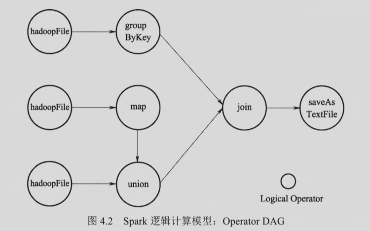
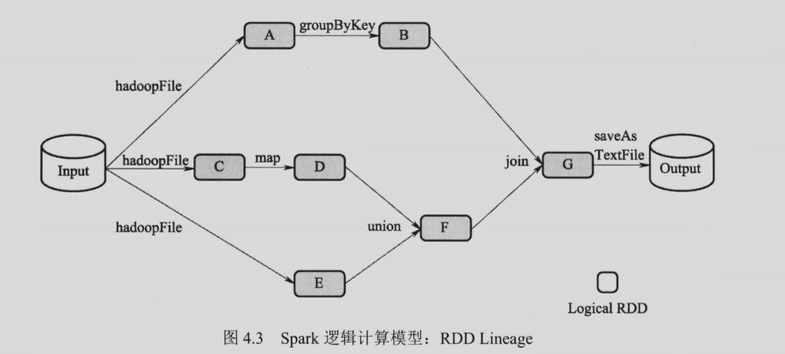
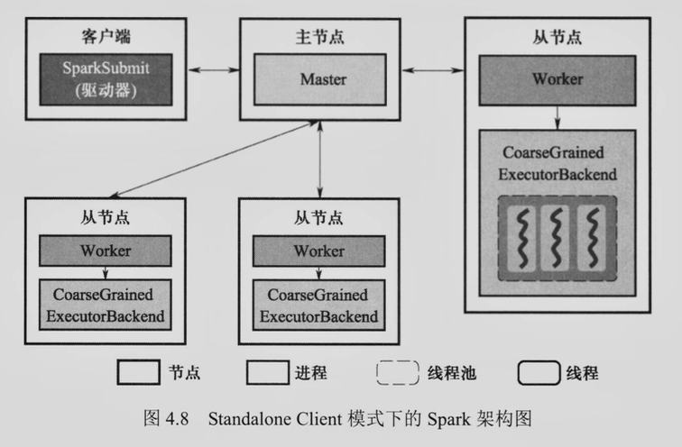
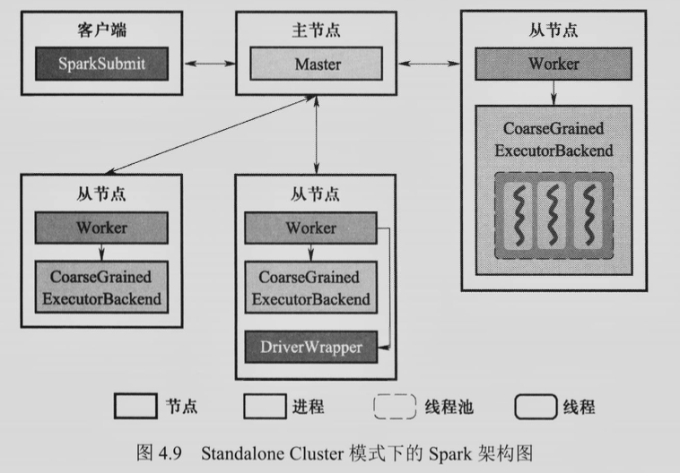

# 习题 4

#### 1. 与 Spark 相比，MapReduce 存在哪些局限性？

1. 编程框架的表达能力有限，用户编程复杂。MapReduce 仅提供 map 和 reduce 两个编程算子，用户需要基于这两个算子实现数据处理的操作，如 join、sort 等常用算子，都需要用 map 和 reduce 来实现，这增加了编程难度
2. 单个作业的 Shuffle 阶段的数据以阻塞方式传输，磁盘 IO 的开销大、延迟高。单个作业的 Shuffle 阶段，Map 端需要将计算结果写入本地磁盘，之后 Reduce 端才可以读取该计算结果。因此，Shuffle 阶段磁盘 IO 开销大，并且这种阻塞式数据传输方式加剧了 MapReduce 作业的高延迟
3. 多个作业之间衔接涉及 IO 开销，应用程序的延迟高。对于单个 MapReduce 作业来说，通常从 HDFS 等存储系统读入输入文件，作业执行完的结果输出到 HDFS 等存储系统。然而，很多应用程序需要通过多个作业来完成，如机器学习的迭代训练过程。迭代计算的中间结果反复读写，使整个应用的延迟非常高

#### 2. 请说明 Spark 的逻辑计算模型和物理计算模型之间的区别与联系。

逻辑计算模型中，Operator DAG 从算子的角度来描述计算的过程。RDD Lineage 从数据（RDD 变换）的角度来描述计算过程。逻辑执行图描绘了算子之间的数据流动关系，物理执行图是从逻辑执行图过来的，逻辑执行图上的一个算子在物理执行图上面会有多个并行实例。

#### 3. 什么是 RDD Lineage？当 Lineage 较长时，如何加快故障恢复？

RDD Lineage 是 Driver 中 SparkContext 维护的记录 RDD 转换的 DAG。RDD Lineage 通过读入外部数据源进行 RDD 创建，经过一系列的转换操作，每次生成不同的 RDD 以供下一次转换操作使用。最后一个 RDD 经过 “行动” 操作进行转换，输出到外部数据源。

当某一 RDD 的部分分区丢失时，其可通过 Lineage 获取足够的信息来重新计算和恢复丢失的数据分区。

若 Lineage 较长，或其存在较多宽依赖，需要在适当的时机设置数据检查点。对中间的某个 RDD 进行写检查点操作，写入可靠的外部分布式文件系统，比如 HDFS 后，再在需要进行检查点计算时读取。依据检查点重新计算，可以加快恢复进程。

#### 4. 请简述 Standalone Client 与 Standalone Cluster 两种模式下 Spark 架构的区别，并画出两种模式下的架构图。

1. Standalone Client 模式下，Driver 和 Client 以同一个进程存在
2. Standalone Cluster 模式下，Driver 为某一个 Worker 启动的一个名为 DriverWrapper 的进程

#### 5. Spark 如何划分 DAG 中的 Stage?

一个 DAG 由多个 Stage 组成，DAG 调度器通过分析各个 RDD 中的分区之间的依赖关系来决定如何划分 Stage。简单来说，DAG 调度器针对 DAG 做反向解析，遇到宽依赖则生成新的 Stage，遇到窄依赖就把该 Operator 加入到当前 Stage 中，从而使得窄依赖尽量被划分在同一个 Stage 中。因此，Stage 内部生成的 RDD 之间是窄依赖关系，而 Stage 输出 RDD 和下一 Stage 输入 RDD 之间是宽依赖关系。也就是说，只有 Stage 之间的数据传输需要 Shuffle。

#### 6. Spark 中的应用和作业是何种关系？

应用 = Application；作业 = Job

从逻辑角度看：一个 Application 由一个或多个 DAG 组成，一个 DAG 对应物理执行角度为一个 Job

从物理执行角度看：一个 Application 等于一个或多个 Job

#### 7. Spark 中 Stage 与 Task 存在怎样的联系？

Task 指运行在 Executor 上的工作单元

一个 Job 会分为多组 Task，每组 Task 被称为 Stage，或者也被称为 TaskSet，Stage 是 Job 的基本调度单位。

Stage 代表了一组关联的、相互之间没有 Shuffle 依赖关系的 Task 组成的 TaskSet

#### 8. Spark 中 Stage 内部如何进行数据交换？Stage 之间如何进行数据交换？

Stage 内部数据交换：Spark 采用流水线（Pipeline）方式进行 Stage 内部的数据交换

Stage 之间数据交换：Spark 在 Stage 之间数据交换时需要 Shuffle，Shuffle 可能发生在两个 ShuffleMapStage 之间，或者 ShuffleMapStage 和 ResultStage 之间，简化 Shuffle 过程为 Shuffle Write 和 Shuffle Read 两个阶段

- Shuffle Write 阶段：ShuffleMapTask 将输出 RDD 的记录按照分区函数划分道相应的 bucket 中，物化到本地磁盘形成 ShuffleblockFile（之后才能被 Shuffle Read 阶段拉取）
- Shuffle Read 阶段：ShuffleMapTask 或者 ResultTask 根据 partition 函数读取相应的 ShuffleblockFile，存入缓存区并继续进行后续的计算。

#### 9. Spark 的RDD持久化和检查点机制存在哪些异同点？

相同之处：

1. RDD 持久化和设置检查点机制都可以为 Spark 提供容错

不同之处：

1. RDD 持久化在是在 Spark **内部**某些节点存储多个备份，而检查点机制将 RDD 写入**外部可靠**的（本身具有容错机制）分布式文件系统，例如 HDFS
2. RDD 持久化可以加快计算速度，并且作为备份快速恢复因故障丢失的数据分区，而检查点机制仅服务于 Spark 的故障恢复（减少恢复过程的代价）
3. RDD 的持久化发生在计算过程中，而写检查点操作是系统在作业结束之后启动一个独立的作业进行的。
4. 二者的生命周期不同，持久化的 RDD 会在程序结束后会被清除，而检查点在程序结束后依然存在，不会被删除
5. 持久化的 RDD 会保留 RDD Lineage，但使用检查点机制会失去 RDD Lineage，具体来说，是将下一个 RDD 的依赖设置为这个 checkpoint 本身，而不是之前的 RDD Lineage

#### 10. Spark 的广播变量机制通常用于什么场景？

适用于需要节约内存的场景，如小表和大表自然连接（部门表 join 雇员表）

大表的 Shuffle 开销大，把小表广播出去可以避免大表进行 Shuffle

