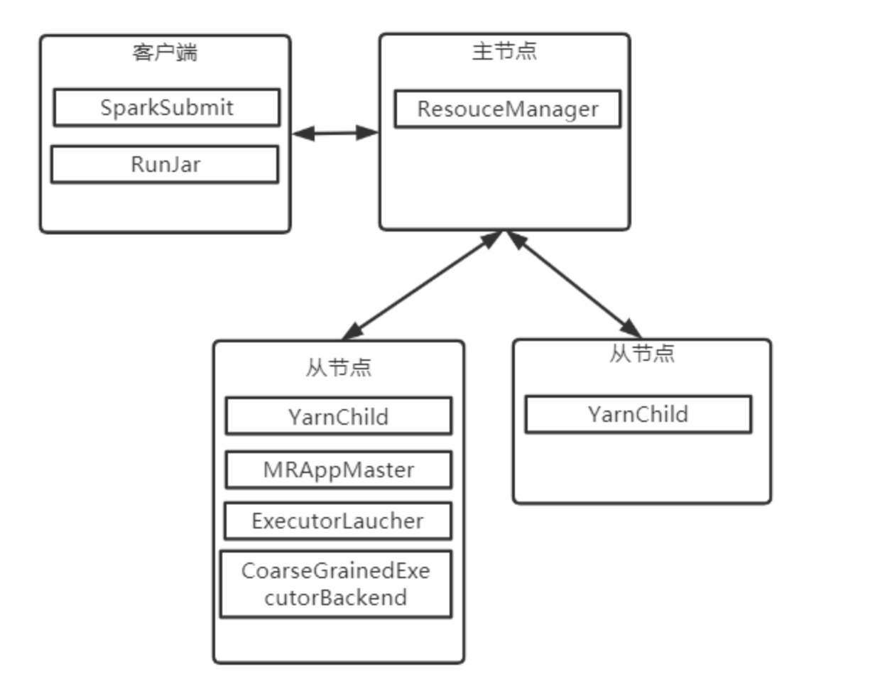

# 习题 5

#### 1. 对于 MapReduce 和 Spark 而言，应用与作业是否存在区别？

对于 MapReduce 而言，应用和作业没有区别。

对于 Spark 而言，应用包含作业，一个应用中可以有多个作业。在程序上，一个应用与一个 SparkContext 对应；一个作业与一个 action 对应。

#### 2. Spark 架构与 Yarn 架构在设计理念上有无共同点？

两者都是主从架构，并且都是将作业管理与资源管理相分离，使作业之间可以相互独立地控制执行。

#### 3. 第二代 Hadoop 与第一代相比的优势是什么？

第一代 MapReduce 的资源管理功能和作业管理功能是紧耦合的，JobTracker 既负责作业管理也负责调度资源。并且作业管理高度集中于JobTracker，其负责所有作业的管理，内存开销更大。当作业数量增加时，JobTracker与各个作业所在节点的通信增大，造成开销增大，造成JobTracker进程的不稳定。

第二代MapReduce中，资源管理功能由Yarn中的ResourceManager 和 NodeManager 负责。客户端提交应用后，Yarn 将会启动 MRAppMaster 进程管理该应用。MRAppMaster 根据 Yarn 分配的资源进行任务调度，并启动 YarnChild 进程执行 Map 或者 Reduce 任务。一个 MRAppMaster 仅管理一个应用。引入 Yarn 之后，JobTracker 和 TaskTracker 消失了，资源管理功能依赖于 ResourceManager 和 NodeManager，作业管理功能依赖于 MRAppMaster。

#### 4. Yarn 的主要部件都有什么？

- ResourceManager（RM）：负责整个系统资源调度和分配的资源管理器，主要由调度器和应用管理器两个组件构成。其中，调度器负责分配 container 并且进行资源调度；应用管理器负责管理整个系统中运行的所有应用，包括应用程序提交、与调度器协商资源以启动 ApplicationMaster、监控 ApplicationMaster 的运行状态等。
- NodeManager（NM）：负责节点资源和任务资源的节点管理器。一方面，NM 定期向 RM 汇报本节点的资源使用情况和 Container 运行状态；另一方面，NM 接受并处理来自 AM 的 Container 启动 / 停止等各种请求。
- ApplicationMaster（AM）：每当用户基于 Yarn 平台提交一个框架应用，Yarn 均会启动一个 AM 以管理该应用。一方面，AM 和 RM 调度器通过协商获取资源（以 Container 表示），将获取到的资源进一步分配给作业内部的任务；另一方面，AM 与 NM 通信以启动 / 停止任务，监控所有任务运行状态，并在任务发生故障时重新申请资源以重启任务。
- Container：Container 为资源的抽象表示，包含 CPU、内存等资源，是一个动态资源划分单位。当 AM 向 RM 申请资源时，RM 向 AM 返回以 Container 表示的资源。

#### 5. Yarn 中的 Container 由谁负责启动 / 停止？

AM 向 RM 请求资源，确定资源分配方式后向 NM 通信获取 Container 资源。任务结束时，AM 逐步释放占用的资源，最终向 RM 注销并且自行关闭。

#### 6. 简要分析 FIFO Scheduler，Capacity Scheduler 和 Fair Scheduler 三种调度器的优缺点。

FIFO 仅维护一个队列，该队列拥有该集群上的所有资源，策略是先提交的应用先分配所有资源。可能会造成一个进程独占资源，其他进程不断等待而导致总体的执行时间变长。

Capacity 调度器维护一个层级式的队列，可以避免所有资源被一个进程独占的情况。不过这会让一些队列的资源空闲，不能得到充分的利用。

Fair 调度器允许队列间共享资源，最大程度上避免了资源的浪费。但是其实现比较复杂，并且由于进程之间的互相切换容易产生较大的代价。

#### 7. 简述 ApplicationMaster 申请资源的过程。

1. AM 将应用解析为作业并且进一步分解为若干任务，并向 RM 申请启动这些任务的资源。
2. RM 向提出申请的 AM 提供以 Container 形式表示的资源。
3. AM 确定资源在各个任务之间的分配方案。
4. AM 确定资源分配方案后，与对应的 NM 通信并且在相应的 Container 中启动相应的进程以执行任务。

#### 8. NodeManager 是否监控 container 中任务的执行情况？

不监控，由 ApplicationMaster 监控。

#### 9. ApplicationMaster 由谁监控？并写出容错恢复过程。

AM 由 RM 监控。如果 AM 发生故障，Yarn 会重启进程，但不会恢复运行状态，运行状态需要由框架恢复

#### 10. 为什么引入 Yarn 以后，MapReduce 无法独立运行？

引入 Yarn 之后，JobTracker 和 TaskTracker 消失了，资源管理功能依赖于 ResourceManager 和 NodeManager，作业管理功能依赖于 MRAppMaster。MapReduce 不可能对其本身进行资源管理和作业管理，也就不可能独立运行。

#### 11. Yarn 平台运行 MapReduce 的方式与 Spark 的 Yarn Client 和 Yarn Cluster 哪个更像？为什么？

对于 Client 模式，ExecutorLauncher 不负责应用的管理，只负责分配资源和启动任务，而 Cluster 模式（ApplicationMaster）既负责应用的管理，也负责分配资源和启动任务。对于 MapReduce，在启动任务时会启动管理进程 MRAppMaster 管理应用，同时负责资源分配和管理任务。所以和 Cluster 模式更加接近。

#### 12. 试画出 Yarn 同时运行 MapReduce 和 Spark 的架构图，其中 Spark 程序以 Yarn Client 模式执行。

